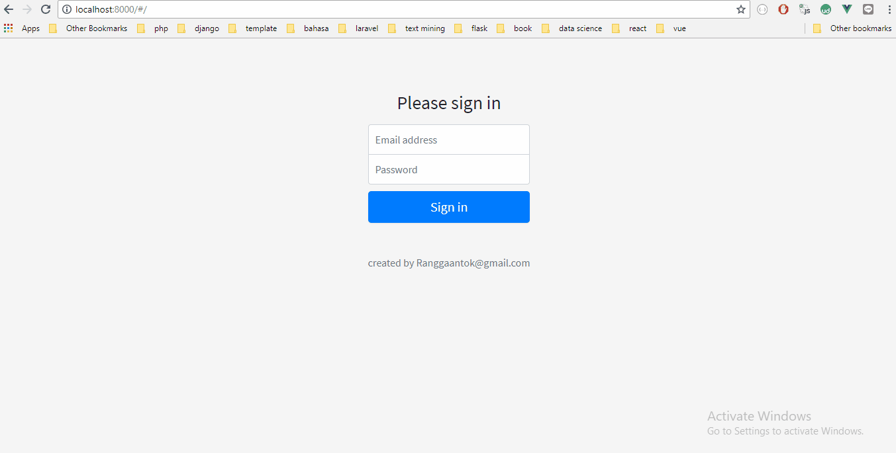
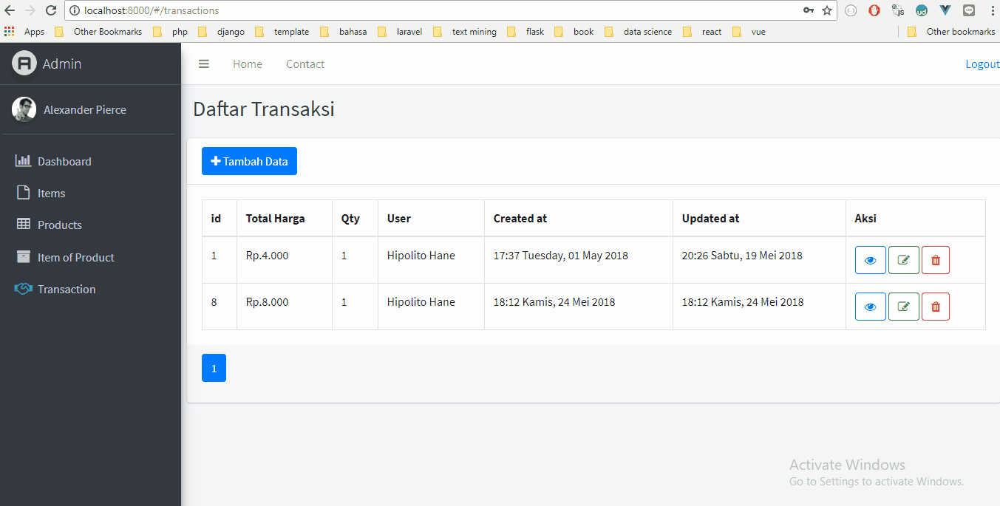
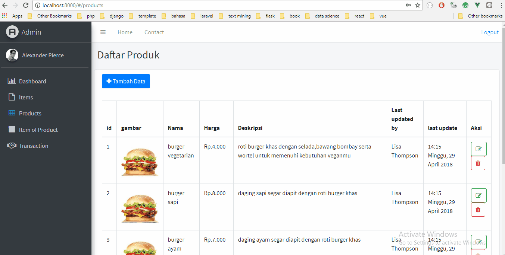
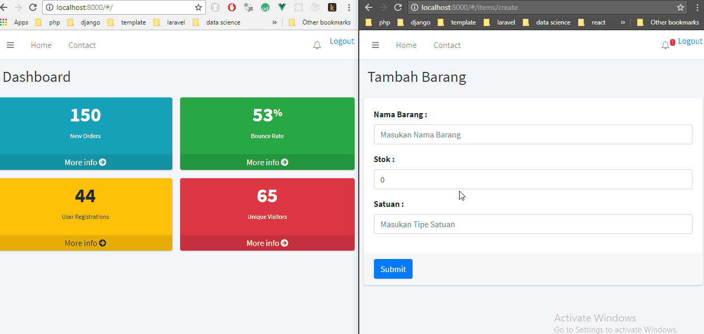

# Single Page Application - Admin
using laravel+vueJS to create SPA



**dynamic form** <br>


**upload image** <br>


**push notification** <br>


**about** <br>
simple admin for Point of Sale Apps

**tech** <br>
1.Frontend : VueJS + AdminLTE<br>
2.Backend : Laravel + MySQL + Pusher

**How to use** <br>
1.migrasi database dengan ```php artisan migrate``` atau import db.sql<br>
2.install php dependancy dengan composer ```composer install```<br>
3.install javascript dependancy dengan npm ```npm install```<br>
4.jalankan server dengan ```php artisan serve```<br>
5.konfigurasi file env
